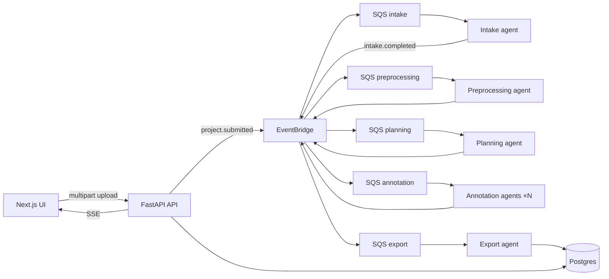

# EventForge

**Event-driven dataset intelligence platform** — upload files + annotation schema → pipeline labels segments in parallel → JSONL export with QC metrics and live React Flow visibility.

Portfolio project focused on production event-driven patterns — idempotency, DLQ, correlation IDs, cost controls, observability — with a BeatPulse-style labeling pipeline as the workload.

**Pivot status:** Phases 0–8 complete (data model → full pipeline → UI). See [`docs/PIVOT_PLAN.md`](./docs/PIVOT_PLAN.md).

## Architecture (at a glance)



Agents communicate via **events only** (no agent-to-agent HTTP). Every event carries `correlation_id` for tracing end-to-end.

Full diagrams: [`docs/ARCHITECTURE.md`](./docs/ARCHITECTURE.md) · product vision: [`docs/DATASET_PLATFORM.md`](./docs/DATASET_PLATFORM.md)

---

## Stack

| Layer             | Tech                                                                       |
| ----------------- | -------------------------------------------------------------------------- |
| **API**           | Python 3.12+, FastAPI, Pydantic v2, SQLAlchemy 2.0, uv                     |
| **Workers**       | Async SQS consumers — intake, preprocessing, planning, annotation, export  |
| **Events**        | EventBridge + SQS (+ Step Functions Map for annotation fan-out)            |
| **Data**          | Postgres 16 (OLTP; pgvector removed in pivot)                              |
| **Storage**       | Local disk (`./data/uploads/{project_id}/`)                                |
| **LLM**           | OpenAI + Anthropic — segment labeling with JSON schema validation          |
| **Resilience**    | Exponential backoff retries, circuit breakers, optional `JOB_MAX_COST_USD` |
| **Frontend**      | Next.js 16, shadcn/ui, TanStack Query, React Flow, SSE                     |
| **Auth**          | Mock user only — open API (ADR-013); no login UI                           |
| **Observability** | OpenTelemetry → OTLP collector → Jaeger                                    |
| **Local**         | Docker Compose + LocalStack                                                |

**Archived (not maintained for current pivot):** AWS ECS deploy, Terraform applies — see ADR-015. Terraform modules remain in `infra/terraform/` for reference.

---

## Local dev

**Prerequisites:** Docker, Python 3.12+, [uv](https://docs.astral.sh/uv/), Node.js 20+

```bash
cp .env.example .env
./scripts/setup-local.sh    # first time
make dev                    # Postgres + LocalStack + backend + frontend + OTEL + Jaeger

cd backend && uv run alembic upgrade head   # migrations
```

| Service  | URL                        |
| -------- | -------------------------- |
| Frontend | http://localhost:3000      |
| Backend  | http://localhost:8000      |
| API docs | http://localhost:8000/docs |
| Jaeger   | http://localhost:16686     |

**LLM keys** (in `.env` — required for real annotation path):

```bash
OPENAI_API_KEY=sk-...
ANTHROPIC_API_KEY=sk-ant-...   # optional second provider
LLM_DEFAULT_MODEL=gpt-4o-mini
JOB_MAX_COST_USD=2.0           # optional — per-job LLM spend cap (omit to disable)
```

By default `MOCK_EXTERNAL_APIS` only affects legacy embedding fixtures (unused in the dataset pipeline). **LLM calls always use your API keys** (`OPENAI_API_KEY` / `ANTHROPIC_API_KEY`).

**Hybrid (hot reload):** run infra in Docker, API + frontend natively:

```bash
docker compose up postgres localstack
cd backend && uv sync && uv run uvicorn eventforge.main:app --reload --port 8000
cd frontend && cp .env.example .env.local && npm install && npm run dev
```

**Workers** (required for pipeline to complete):

```bash
make workers   # all 5 stage workers + DLQ handler via Honcho (Procfile)
```

Procfile stages map to: `intake`, `preprocessing`, `planning`, `annotation`, `export`.

**Observability** (OTEL + Jaeger — included in `make dev`):

```bash
OTEL_ENABLED=true
OTEL_EXPORTER_OTLP_ENDPOINT=http://localhost:4317
OTEL_SERVICE_NAME=eventforge

open http://localhost:16686   # search by correlation_id from project response
```

Detail: [`docs/LOCAL_DEV.md`](./docs/LOCAL_DEV.md)

---

## 5-minute demo (browser)

1. Open http://localhost:3000
2. **New project** → upload `.txt` / `.md` / `.pdf` files
3. Select template **Support call annotation** (or document classification)
4. Watch React Flow: Intake → Preprocessing → Planning → Annotation → Export
5. Review **QC panel** — coverage, schema compliance, confidence flags
6. **Download JSONL** — labeled rows with provenance per line

---

## Try the API

```bash
# Health
curl http://localhost:8000/health

# Create project (multipart upload)
curl -X POST http://localhost:8000/api/v1/projects \
  -F "name=Support calls batch" \
  -F "schema_template=support_call" \
  -F "domain=support_calls" \
  -F "files=@call_001.txt"

# List projects
curl http://localhost:8000/api/v1/projects

# Project detail (use job_id from create response)
curl http://localhost:8000/api/v1/projects/{job_id}

# Download JSONL (when export completes)
curl http://localhost:8000/api/v1/projects/{job_id}/export

# QC report
curl "http://localhost:8000/api/v1/projects/{job_id}/export?format=qc"

# Live pipeline updates (SSE)
curl -N http://localhost:8000/api/v1/projects/{job_id}/stream
```

E2E script: `./scripts/verify-pipeline-e2e.sh` (updated in Phase 9)

OpenAPI docs: http://localhost:8000/docs · regenerate frontend types: `make openapi`

---

## Project structure

```
event-driven/
├── backend/src/eventforge/
│   ├── agents/               # intake, preprocessing, planning, annotation, export
│   ├── workers/              # SQS consumers per stage
│   ├── services/
│   │   ├── storage/          # local file uploads
│   │   ├── intake/           # validation + schema templates
│   │   ├── preprocessing/    # extract + segment (txt, md, pdf)
│   │   ├── planning/         # task batching from schema
│   │   ├── annotation/       # LLM labeler
│   │   ├── export/           # JSONL merge + QC
│   │   ├── llm/              # OpenAI/Anthropic client
│   │   └── resilience/       # retry, circuit breaker, cost cap
│   ├── events/               # EventBridge publisher + Pydantic schemas
│   └── db/                   # models, repositories, migrations
├── shared/events/            # JSON Schema contracts (source of truth)
├── frontend/src/
│   ├── app/                  # /, /projects/new, /projects/[id]
│   ├── components/           # layout, dashboard (QC, export), workflow (React Flow)
│   ├── hooks/                # useJobStream (SSE), use-projects (TanStack Query)
│   └── types/api.ts          # generated from OpenAPI (npm run codegen)
├── infra/docker/             # LocalStack init, OTEL collector
├── infra/terraform/          # archived — not maintained for pivot (ADR-015)
├── fixtures/support-calls/   # demo transcript snippets (Phase 10)
└── docs/                     # pivot plan, architecture, ADRs, local dev
```

---

## Documentation

| Doc                                                      | Purpose                                                      |
| -------------------------------------------------------- | ------------------------------------------------------------ |
| [`docs/DATASET_PLATFORM.md`](./docs/DATASET_PLATFORM.md) | **Target product** — pipeline, schema templates, terminology |
| [`docs/PIVOT_PLAN.md`](./docs/PIVOT_PLAN.md)             | **Active roadmap** — phase checklist and progress            |
| [`docs/ARCHITECTURE.md`](./docs/ARCHITECTURE.md)         | System design, event flows, diagrams                         |
| [`docs/TECH_DECISIONS.md`](./docs/TECH_DECISIONS.md)     | ADRs (pivot ADR-014, local-only ADR-015)                     |
| [`docs/LOCAL_DEV.md`](./docs/LOCAL_DEV.md)               | Troubleshooting and worker setup                             |
| [`docs/TASKS.md`](./docs/TASKS.md)                       | Legacy phase roadmap (Phases 0–6)                            |
| [`docs/ISSUES.md`](./docs/ISSUES.md)                     | Problems solved (STAR postmortems)                           |

For Cursor agents: [AGENTS.md](./AGENTS.md) · [`.cursor/rules/`](./.cursor/rules/)

---

## AWS deploy (archived)

EventForge previously ran on **ECS Fargate** in `eu-west-2`. Terraform and CI/CD workflows remain in the repo but are **not maintained** during the dataset pivot (ADR-015). Current target is **LocalStack + workers locally**.

For historical deploy docs: [`docs/CICD.md`](./docs/CICD.md) · [`infra/terraform/README.md`](./infra/terraform/README.md)

---

## License

MIT — portfolio project.
