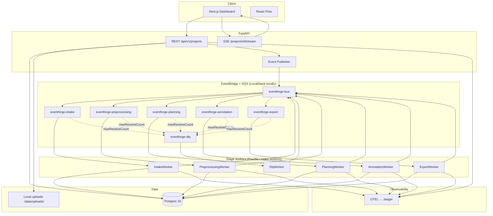
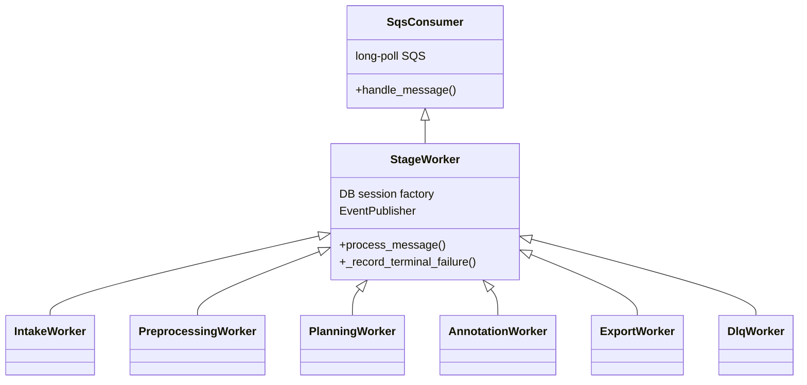

# EventForge — System Architecture

> **Dataset intelligence platform (current).** Product vision: [`DATASET_PLATFORM.md`](./DATASET_PLATFORM.md) · phase checklist: [`PIVOT_PLAN.md`](./PIVOT_PLAN.md).  
> **Infra scope:** LocalStack + long-poll workers locally (ADR-015). AWS ECS deploy is archived.

**Version:** 0.2 (dataset pivot)  
**Last updated:** 2026-08-06

---

## 1. High-Level Overview

EventForge is a **hybrid architecture**: Next.js for upload + live pipeline UI, FastAPI for the HTTP API, and **event-driven stage workers** (SQS consumers) for pipeline processing. Agents communicate via EventBridge events only — no agent-to-agent HTTP.



---

## 2. Pipeline event flow

```
eventforge.project.submitted
  → eventforge.intake.completed
  → eventforge.preprocessing.completed
  → eventforge.planning.completed
  → eventforge.annotation.task.dispatched (×N)
  → eventforge.annotation.task.completed (×N)
  → eventforge.annotation.all_completed
  → eventforge.export.completed
```

On terminal failure: `eventforge.pipeline.failed` (from stage worker or DLQ handler).

---

## 3. Stage workers

All pipeline workers live under `backend/src/eventforge/workers/`. Start locally via **`make workers`** (Honcho reads [`Procfile`](../Procfile)) or run modules individually, e.g. `python -m eventforge.workers.intake`.

### 3.1 Worker inventory

| Worker                  | Module                     | SQS queue                  | Consumes (`detail_type`)                                                           | Stage handler                            | Publishes                                                                             |
| ----------------------- | -------------------------- | -------------------------- | ---------------------------------------------------------------------------------- | ---------------------------------------- | ------------------------------------------------------------------------------------- |
| **IntakeWorker**        | `workers/intake.py`        | `eventforge-intake`        | `eventforge.project.submitted`                                                     | `stages/intake.run_intake`               | `intake.completed`                                                                    |
| **PreprocessingWorker** | `workers/preprocessing.py` | `eventforge-preprocessing` | `eventforge.intake.completed`                                                      | `stages/preprocessing.run_preprocessing` | `preprocessing.completed`                                                             |
| **PlanningWorker**      | `workers/planning.py`      | `eventforge-planning`      | `eventforge.preprocessing.completed`                                               | `stages/planning.run_planning`           | `planning.completed`                                                                  |
| **AnnotationWorker**    | `workers/annotation.py`    | `eventforge-annotation`    | `planning.completed` (sequential fan-out) **or** `annotation.task.dispatched` (×N) | `stages/annotation`                      | `annotation.task.dispatched`, `annotation.task.completed`, `annotation.all_completed` |
| **ExportWorker**        | `workers/export.py`        | `eventforge-export`        | `eventforge.annotation.all_completed` (ignores `annotation.task.completed`)        | `stages/export.run_export`               | `export.completed`                                                                    |
| **DlqWorker**           | `workers/dlq.py`           | `eventforge-dlq`           | Any poison message after retries                                                   | `services/pipeline_failure`              | `pipeline.failed`                                                                     |

Queue names use prefix from config (`SQS_QUEUE_PREFIX`, default `eventforge`). See `core/config.py` properties `*_queue_name`.

### 3.2 Shared worker runtime



| Layer           | File                      | Role                                                                                                     |
| --------------- | ------------------------- | -------------------------------------------------------------------------------------------------------- |
| **SqsConsumer** | `workers/base.py`         | Resolve queue URL, long-poll, ack/delete on success                                                      |
| **StageWorker** | `workers/stage_worker.py` | DB session + publisher wiring; on `ValueError`/`RuntimeError` → mark job failed + emit `pipeline.failed` |
| **Stage logic** | `stages/*.py`             | Idempotent business logic, OTEL spans, Postgres writes, next event publish                               |
| **Bootstrap**   | `workers/bootstrap.py`    | `main(WorkerClass)` — OTEL init + asyncio run loop                                                       |

**Message parsing (two steps):**

1. **Worker (happy path):** `parse_eventbridge_sqs_body` → stage-specific `parse_*_event` → typed Pydantic model → `run_*`.
2. **StageWorker (error path only):** re-parse SQS body → `parse_failed_event_detail` → generic `EventEnvelope` so failures can be recorded even if the worker failed mid-parse.

`DlqWorker` sets `record_terminal_failures = False` (DLQ messages are already terminal).

### 3.3 Annotation fan-out modes

| Mode                           | Config                                     | Behavior                                                                                                                                      |
| ------------------------------ | ------------------------------------------ | --------------------------------------------------------------------------------------------------------------------------------------------- |
| **Sequential (default local)** | `ANNOTATION_ORCHESTRATION_MODE=sequential` | `AnnotationWorker` handles `planning.completed`, dispatches N `annotation.task.dispatched` events, then processes each task on the same queue |
| **Step Functions**             | `step_functions`                           | Worker skips `planning.completed`; LocalStack SF Map sends `annotation.task.dispatched` with optional task token                              |

Annotation and export workers wrap stage calls with **`run_with_cost_cap_handling`** (`workers/cost_cap.py`) when `JOB_MAX_COST_USD` is set.

### 3.4 Preprocessing notes (text + audio)

| Asset type                    | Preprocessing                                                                                                     |
| ----------------------------- | ----------------------------------------------------------------------------------------------------------------- |
| `.txt`, `.md`, `.pdf`         | Extract text → character-chunk segments                                                                           |
| `.wav` (`support_call_audio`) | Local **faster-whisper** ASR → LLM speaker roles → agent/customer turn segments; Whisper model cached per worker process (`get_asr_provider`) |

---

## 4. Frontend & API (summary)

| Component                | Responsibility                                  |
| ------------------------ | ----------------------------------------------- |
| `app/projects/new`       | Upload + schema template picker                 |
| `app/projects/[id]`      | React Flow pipeline + QC panel + JSONL download |
| `hooks/useJobStream`     | SSE keyed by `correlation_id`                   |
| `api/routes/projects.py` | `POST/GET /api/v1/projects`, export download    |
| `api/routes/stream.py`   | `GET /api/v1/projects/{id}/stream`              |

API publishes `project.submitted` after multipart upload; it does **not** run stage logic inline.

---

## 5. Data stores

| Store          | Data                                                                                                                 |
| -------------- | -------------------------------------------------------------------------------------------------------------------- |
| **Postgres**   | Users, jobs (projects), stages, assets, segments, annotation tasks/batches, exports, `processed_events`, `llm_usage` |
| **Local disk** | Uploaded files under `./data/uploads/{project_id}/`                                                                  |

pgvector and S3 are **not** used in the dataset pivot (removed / not maintained).

---

## 6. Idempotency & resilience

### Idempotency

```
processed_events(event_id PK, worker_name, processed_at)
```

Each stage claims `event_id` before side effects. Duplicate SQS delivery → skip and ack.

### Retry & failure

| Layer                 | Policy                                                                                                  |
| --------------------- | ------------------------------------------------------------------------------------------------------- |
| SQS                   | `maxReceiveCount: 3` → `eventforge-dlq`                                                                 |
| Stage terminal errors | `ValueError` / `RuntimeError` → job marked failed, `pipeline.failed`, message acked (no DLQ retry loop) |
| Other exceptions      | Message left for SQS retry → DLQ                                                                        |
| DLQ                   | `DlqWorker` emits `pipeline.failed`, updates job/stage                                                  |
| LLM                   | Retries + circuit breaker; optional per-job cost cap                                                    |

---

## 7. Observability

Spans: `agent.{stage}.{action}` (e.g. `agent.asr.transcribe`, `agent.preprocessing.process`).

Required context: `correlation_id`, `job_id`, `event_id`.

Local: OTEL collector + Jaeger (`http://localhost:16686`). Search by `correlation_id` from the project create response.

---

## 8. Local development

| Concern           | Local                                      |
| ----------------- | ------------------------------------------ |
| EventBridge / SQS | LocalStack                                 |
| Postgres          | Docker `postgres:16`                       |
| Workers           | `make workers` → 6 processes from Procfile |
| API               | `uvicorn eventforge.main:app --reload`     |
| Frontend          | `npm run dev`                              |

Detail: [`LOCAL_DEV.md`](./LOCAL_DEV.md)

---

## 9. Key design decisions

See [`TECH_DECISIONS.md`](./TECH_DECISIONS.md). Summary:

1. **Event-first** — stages decoupled via EventBridge + SQS
2. **One queue per stage** — independent failure domains
3. **StageWorker base** — shared SQS wiring + terminal failure recording
4. **Business logic in `stages/`** — workers stay thin adapters
5. **SSE for UI** — unidirectional pipeline updates (ADR-010)
6. **Local-only pivot** — no maintained AWS deploy (ADR-015)

---

## 10. API surface (current)

```
POST   /api/v1/projects              # Multipart upload + schema template
GET    /api/v1/projects              # List projects
GET    /api/v1/projects/{id}         # Detail + stages + QC
GET    /api/v1/projects/{id}/stream  # SSE pipeline events
GET    /api/v1/projects/{id}/export  # JSONL or ?format=qc
GET    /api/v1/health
GET    /api/v1/health/ready
```

OpenAPI: `shared/openapi/eventforge-api.yaml`

---

## Appendix — Legacy research pipeline (archived)

Pre-pivot EventForge used a **research/RAG** flow (`query.submitted` → ingestion → embedding → knowledge mining → research fan-out → synthesis) with pgvector, Tavily, and ECS deploy. That code path was removed during pivot Phases 6–9.

Do not extend the legacy design. For historical context only, see git history before 2026-08 and archived docs in [`TASKS.md`](./TASKS.md) / [`PRD.md`](./PRD.md).

**AWS deploy (Phase 5):** full Terraform/ECS topology with Mermaid diagrams — [`AWS_ARCHITECTURE.md`](./AWS_ARCHITECTURE.md).
