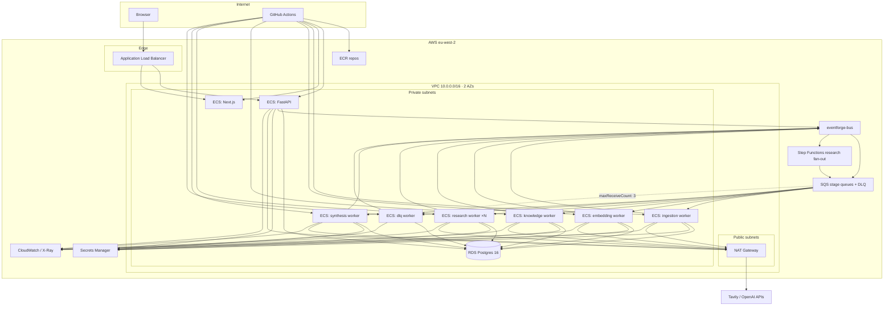
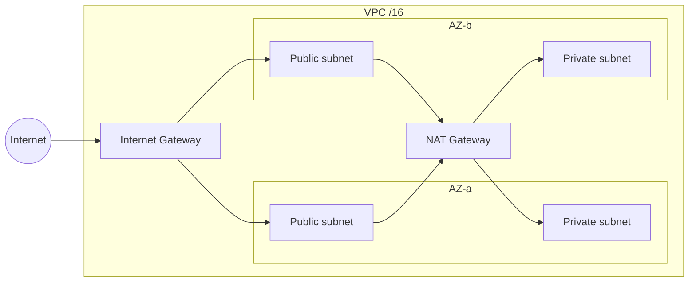
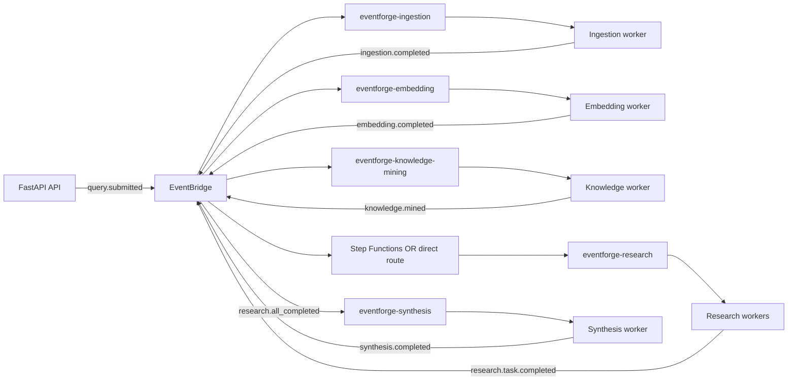
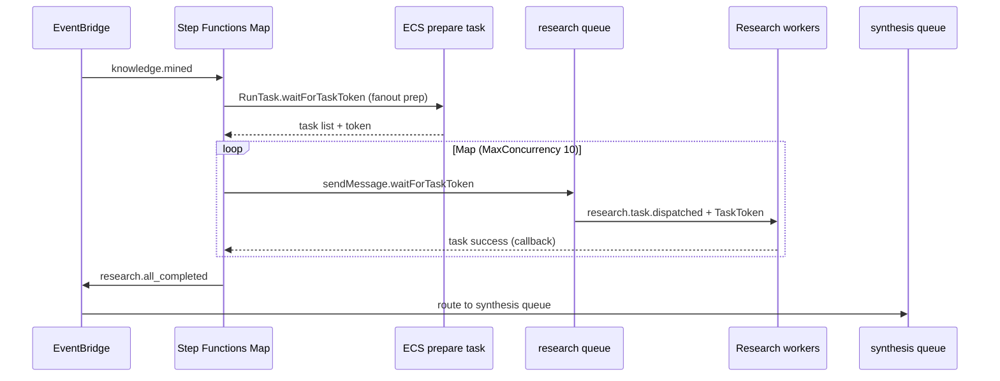
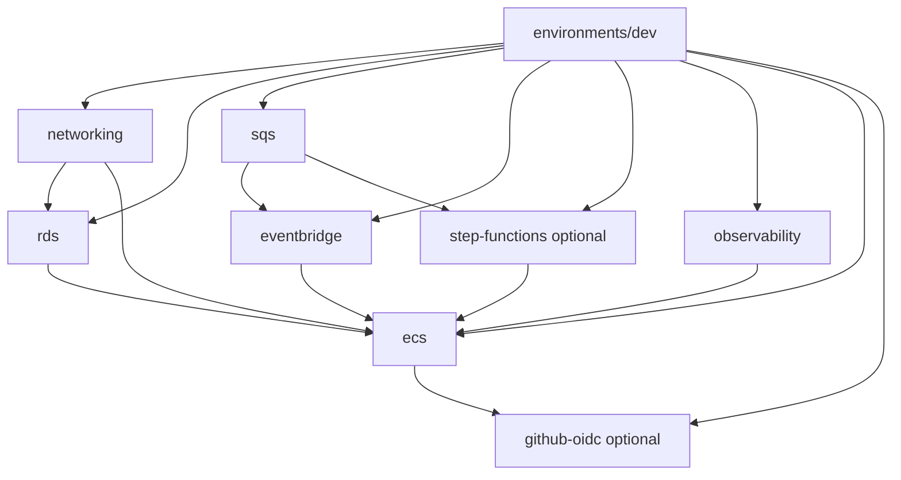
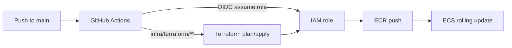

# EventForge — AWS Architecture (Archived Reference)

> **Status:** **Not maintained** during the dataset pivot ([ADR-015](./TECH_DECISIONS.md)). Terraform in `infra/terraform/` is portfolio reference from **Phase 5 (research pipeline)**. Active development uses **LocalStack + local workers** — see [`ARCHITECTURE.md`](./ARCHITECTURE.md).
>
> **Region:** `eu-west-2` (London) · **IaC:** Terraform ≥ 1.5 · **Runtime:** ECS Fargate

This document describes **what was provisioned on AWS** when EventForge ran as a cloud-deployed research/RAG pipeline — useful for interviews and portfolio walkthroughs even though it is no longer applied on merge.

---

## 1. What ran on AWS

| Layer | AWS services |
| ----- | ------------ |
| **Edge** | Application Load Balancer (HTTP/HTTPS) |
| **Compute** | ECS Fargate — API, frontend, 6 worker services |
| **Events** | EventBridge custom bus + SQS stage queues + DLQ |
| **Orchestration** | Step Functions Map (optional research fan-out) |
| **Data** | RDS PostgreSQL 16 (+ pgvector via Alembic at the time) |
| **Images** | ECR (backend + frontend) |
| **Secrets** | Secrets Manager (DB password, LLM/Tavily API keys) |
| **Observability** | ADOT sidecar → X-Ray; CloudWatch alarms on DLQ/API |
| **CI/CD** | GitHub Actions OIDC → ECR push + ECS rolling deploy |

**Auth:** Cognito was removed before pivot freeze ([ADR-013](./TECH_DECISIONS.md)) — dev ALB exposed an open API with mock user.

---

## 2. High-level topology



---

## 3. Network layout

Terraform module: `infra/terraform/modules/networking/`



| Resource | Purpose |
| -------- | ------- |
| **Public subnets** | ALB only |
| **Private subnets** | ECS tasks (API, frontend, workers), RDS |
| **NAT gateway** | Outbound from workers/API to Tavily, OpenAI, Anthropic (dev: single NAT) |
| **Security groups** | Separate SGs for ALB, API, frontend, workers, RDS — least-privilege east-west |

---

## 4. ECS services (Fargate)

Terraform module: `infra/terraform/modules/ecs/`

| ECS service | Container | Port | Role |
| ----------- | --------- | ---- | ---- |
| `eventforge-dev-api` | FastAPI | 8000 | REST + SSE; publishes to EventBridge |
| `eventforge-dev-frontend` | Next.js | 3000 | Dashboard + React Flow |
| `eventforge-dev-worker-ingestion` | Python worker | — | SQS long-poll `eventforge-ingestion` |
| `eventforge-dev-worker-embedding` | Python worker | — | `eventforge-embedding` |
| `eventforge-dev-worker-knowledge` | Python worker | — | `eventforge-knowledge-mining` |
| `eventforge-dev-worker-research` | Python worker | — | `eventforge-research` (scalable desired count) |
| `eventforge-dev-worker-synthesis` | Python worker | — | `eventforge-synthesis` |
| `eventforge-dev-worker-dlq` | Python worker | — | `eventforge-dlq` |

- **Cluster:** single ECS cluster per environment
- **Launch type:** Fargate, tasks in private subnets (no public IP)
- **Images:** ECR; entrypoint runs Alembic migrate on API deploy
- **Optional ADOT sidecar:** exports OTLP to localhost → X-Ray when `enable_observability = true`

Worker module entrypoints (from Terraform `locals.workers`):

```
eventforge.workers.ingestion
eventforge.workers.embedding
eventforge.workers.knowledge
eventforge.workers.research
eventforge.workers.synthesis
eventforge.workers.dlq
```

> **Pivot note:** Current codebase uses **dataset stage workers** (`intake`, `preprocessing`, `planning`, `annotation`, `export`). Terraform was **not updated** for the pivot — LocalStack init mirrors the new queues instead.

---

## 5. Event pipeline (as Terraform wired it)

**Event bus:** `eventforge-bus`  
**Queue prefix:** `eventforge-*`



### EventBridge rules (`modules/eventbridge/routes.tf`)

| Rule | `detail-type` | Target queue |
| ---- | ------------- | ------------ |
| query → ingestion | `eventforge.query.submitted` | `ingestion` |
| ingestion → embedding | `eventforge.ingestion.completed` | `embedding` |
| embedding → knowledge | `eventforge.embedding.completed` | `knowledge_mining` |
| research task | `eventforge.research.task.dispatched` | `research` |

**Without Step Functions** (`enable_step_functions_research = false`):

| Rule | `detail-type` | Target queue |
| ---- | ------------- | ------------ |
| knowledge → research | `eventforge.knowledge.mined` | `research` |
| research → synthesis | `eventforge.research.task.completed` | `synthesis` |

**With Step Functions** (`enable_step_functions_research = true`):

| Rule | `detail-type` | Target |
| ---- | ------------- | ------ |
| knowledge → SFN | `eventforge.knowledge.mined` | Step Functions state machine |
| all research done | `eventforge.research.all_completed` | `synthesis` |

### SQS (`modules/sqs/`)

| Queue | Visibility | Redrive |
| ----- | ---------- | ------- |
| `eventforge-ingestion` | 300s | → DLQ after 3 receives |
| `eventforge-embedding` | 300s | → DLQ |
| `eventforge-knowledge-mining` | 300s | → DLQ |
| `eventforge-research` | 300s | → DLQ |
| `eventforge-synthesis` | 300s | → DLQ |
| `eventforge-dlq` | 14-day retention | terminal poison messages |

Each queue has an **SQS queue policy** allowing EventBridge to `SendMessage` only from matching rule ARNs.

---

## 6. Step Functions research fan-out

Terraform module: `infra/terraform/modules/step-functions/`  
Optional via `enable_step_functions_research = true`.



States (simplified):

1. **PrepareFanout** — ECS Fargate task builds N research sub-tasks
2. **FanOutTasks** — Map over tasks; each sends SQS message with Step Functions task token
3. **Research workers** complete and callback SFN
4. **PublishAllCompleted** — emit `research.all_completed` → synthesis queue

This replaced sequential “knowledge → research → synthesis” routing on the research queue when enabled.

---

## 7. Terraform module graph

Environment root: `infra/terraform/environments/dev/`



| Module | Key outputs |
| ------ | ----------- |
| **networking** | `vpc_id`, subnet IDs, security group IDs |
| **rds** | Postgres endpoint, password secret ARN |
| **sqs** | Queue URLs/ARNs map |
| **eventbridge** | Bus ARN, routing rules |
| **step-functions** | State machine ARN (if enabled) |
| **ecs** | Cluster, ALB DNS, ECR URLs, service names |
| **github-oidc** | `github_actions_role_arn` for CI |
| **observability** | ADOT config, DLQ/API alarm ARNs |

Apply order in code: **networking → rds → sqs → eventbridge → (step-functions) → observability → ecs**, plus **github-oidc** after ECS/ECR exist.

Detail: [`infra/terraform/README.md`](../infra/terraform/README.md)

---

## 8. IAM & secrets

| Role | Permissions (summary) |
| ---- | --------------------- |
| **ECS execution role** | Pull ECR images; read Secrets Manager (DB + API keys) |
| **API task role** | `events:PutEvents` on `eventforge-bus` |
| **Worker task role** | SQS consume on assigned queues; `events:PutEvents`; optional X-Ray |
| **Step Functions role** | `ecs:RunTask`, `sqs:SendMessage`, `events:PutEvents` |
| **GitHub OIDC role** | ECR push; ECS `UpdateService`; optional Terraform state S3/DynamoDB |

**Secrets (manual ARNs in tfvars):**

- RDS password — auto-generated in Secrets Manager (`modules/rds`)
- `OPENAI_API_KEY`, `ANTHROPIC_API_KEY`, `TAVILY_API_KEY` — created manually, referenced in ECS task definitions

Never committed: `terraform.tfvars`, tfstate, real secret values.

---

## 9. CI/CD deploy flow (historical)

Removed during pivot; documented in [`CICD.md`](./CICD.md).



| Path change | Deploy action |
| ----------- | ------------- |
| `backend/**` | Build backend image → roll API + all workers |
| `frontend/**` | Build with SSM `NEXT_PUBLIC_*` → roll frontend |
| `infra/terraform/**` | `terraform plan` (PR) / `apply` (main) |

Repository variable: `AWS_DEPLOY_ROLE_ARN` ← `terraform output github_actions_role_arn`

---

## 10. Observability on AWS

When `enable_observability = true`:

- **ADOT collector sidecar** on API + worker tasks
- **OTLP** → localhost `:4317` → **AWS X-Ray**
- **CloudWatch alarms** — DLQ depth, API task health (module `observability`)

Span naming matched local: `agent.{stage}.{action}` with `correlation_id`, `job_id`, `event_id`.

---

## 11. Local vs AWS (today)

| Concern | AWS (archived Terraform) | Local (active pivot) |
| ------- | ------------------------ | -------------------- |
| **Product** | Research/RAG pipeline | Dataset intelligence platform |
| **Workers** | ingestion, embedding, knowledge, research, synthesis | intake, preprocessing, planning, annotation, export |
| **Queues** | `eventforge-ingestion`, … | `eventforge-intake`, … (LocalStack init) |
| **Events** | `query.submitted`, … | `project.submitted`, … |
| **Postgres** | RDS + pgvector (legacy) | Docker Postgres 16, no pgvector |
| **Files** | Would have used S3 in prod designs | Local disk `./data/uploads/` |
| **Deploy** | ECS + GitHub Actions | `make dev` + `make workers` |
| **Step Functions** | Research Map fan-out | Annotation Map (optional; often sequential locally) |

The **patterns** transfer: EventBridge bus, SQS per stage, DLQ, idempotent workers, OTEL, correlation IDs. Only the **stage names and Terraform modules** reflect the older research era.

---

## 12. Related docs

| Doc | Content |
| --- | ------- |
| [`ARCHITECTURE.md`](./ARCHITECTURE.md) | **Current** local / dataset architecture |
| [`AWS_ARCHITECTURE.md`](./AWS_ARCHITECTURE.md) | **Archived** AWS ECS + Terraform reference (Phase 5 research era) |
| [`CICD.md`](./CICD.md) | Active CI + archived deploy workflow |
| [`TECH_DECISIONS.md`](./TECH_DECISIONS.md) | ADR-012 (ECS), ADR-015 (local-only pivot) |
| [`infra/terraform/README.md`](../infra/terraform/README.md) | Module list, apply commands, tfvars |

---

## 13. Portfolio talking points

When presenting this AWS work:

1. **Monorepo → single VPC** — API, UI, and workers as separate ECS services, one event bus, one RDS.
2. **Event-first decoupling** — no worker calls another over HTTP; EventBridge rules + SQS mirror LocalStack locally.
3. **Failure domains** — per-stage queues, DLQ, dedicated DLQ worker, CloudWatch alarm on poison messages.
4. **Fan-out** — Step Functions Map + SQS task tokens for parallel research tasks (production pattern for annotation scale).
5. **Secure deploy** — GitHub OIDC (no long-lived AWS keys in CI), Secrets Manager for runtime secrets.
6. **Honest scope** — pivot moved to local-only; Terraform preserved as reference, not deleted.
