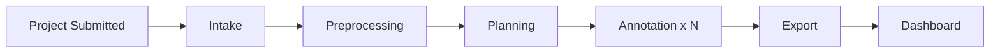

# EventForge — Dataset Intelligence Platform (Target Product)

> **Cursor agents:** Read first during the **Dataset Pivot**.  
> **Implementation plan:** `docs/PIVOT_PLAN.md` (locked decisions + phases)  
> **ADRs:** ADR-014 (pivot), ADR-015 (local-only scope)

**Status:** Pivot in progress · Decisions locked 2026-08-05  
**Inspired by:** [BeatPulse Labs](https://beatpulselabs.com/) — enterprise AI training data infrastructure

---

## 1. What we're building (layman terms)

**Before:** User asks a research question → system searches the web → writes a report.

**After:** User uploads raw files + picks label rules → factory belt processes each file → outputs a clean, labeled dataset for AI training.

Same conveyor-belt machinery (stages, workers, live dashboard). Different product on the belt.

---

## 2. One-sentence pitch

> Event-driven dataset intelligence platform: intake raw assets, preprocess into segments, plan annotation from a custom schema, label in parallel, export model-ready JSONL with QC — orchestrated locally via EventBridge + SQS + workers (LocalStack).

---

## 3. Locked product decisions

| Area | Decision |
|------|----------|
| **Goal** | Portfolio-first; BeatPulse hooks via custom schema + provenance + QC |
| **Demo** | 60% live pipeline (React Flow) / 40% QC + JSONL export |
| **v1 files** | `.txt`, `.md`, `.pdf`, `.wav` (audio via `support_call_audio` template) |
| **Demo story** | Support-call transcripts (text or **WAV → ASR**) + speech-style labels |
| **Schema UX** | 3 templates + optional JSON override |
| **Labeling** | LLM pre-label (no human review UI in v1) |
| **Infra** | LocalStack + workers locally; **no AWS deploy** |
| **Storage** | Local disk (`./data/uploads/`) |
| **Name** | EventForge |

---

## 4. Pipeline stages



| Stage | Agent (UI) | Input | Output |
|-------|------------|-------|--------|
| **Intake** | Intake Agent | Uploaded files | Registered assets |
| **Preprocessing** | Preprocessing Agent | Asset IDs | Text segments (sequential v1) |
| **Planning** | Planning Agent | Segments + schema | Annotation tasks |
| **Annotation** | Annotation Agent ×N | Task + segment batch | Labeled batch (Map fan-out) |
| **Export** | Export Agent | All batches | JSONL + QC report |

### Event flow

```
eventforge.project.submitted
  → eventforge.intake.completed
  → eventforge.preprocessing.completed
  → eventforge.planning.completed
  → eventforge.annotation.task.dispatched (×N)
  → eventforge.annotation.task.completed (×N)
  → eventforge.export.completed
```

---

## 5. Schema templates (v1)

### Support call annotation (demo default)

Fields: `emotion`, `intent`, `topic`, `resolution_status`  
Use with `fixtures/support-calls/*.txt` — plain-text transcripts, speech-flavored labels.

### Document classification

Fields: `category`, `summary`, `sensitivity_flag`  
Use with `.pdf` / `.md` document uploads.

Users pick a template at submit time and may override via JSON editor.

---

## 6. Terminology map (legacy → target)

| Legacy | Target |
|--------|--------|
| `Job` / query | `DatasetProject` / project |
| `Source` (URL) | `Asset` (file) |
| `DocumentChunk` | `Segment` (no embedding) |
| `KnowledgeEntity` | `AnnotationTask` |
| `ResearchNote` | `AnnotationBatch` |
| `SynthesisReport` | `DatasetExport` |

Stage IDs: `intake`, `preprocessing`, `planning`, `annotation`, `export`

---

## 7. Export format (JSONL)

```json
{
  "segment_id": "550e8400-e29b-41d4-a716-446655440000",
  "content": "Customer called about a duplicate charge...",
  "labels": {
    "emotion": "frustrated",
    "intent": "complaint",
    "topic": "billing",
    "resolution_status": "unresolved"
  },
  "provenance": {
    "asset_filename": "call_001.txt",
    "project_id": "...",
    "annotator": "llm-v1",
    "confidence": 0.87
  }
}
```

---

## 8. QC report (export stage)

| Metric | Description |
|--------|-------------|
| **Coverage** | % segments with complete labels |
| **Schema compliance** | Labels match template types/enums |
| **Low-confidence flags** | Segments annotator was unsure about |
| **Cost** | Total LLM spend (from `llm_usage`) |

No HITL review UI in v1 — flags appear in QC only (BeatPulse feedback-loop stub).

---

## 9. What we keep vs remove

### Keep

- EventBridge + SQS + workers via **LocalStack**
- Step Functions Map for **annotation** fan-out (sequential fallback locally)
- Idempotency, DLQ, correlation_id, OTEL, SSE, React Flow
- LLM cost tracking
- FastAPI + Next.js

### Remove

- Tavily web search
- pgvector / embeddings / RAG
- Research synthesis markdown
- `topic` + `depth` query model
- **AWS deploy** (Terraform code retained, not maintained)

---

## 10. BeatPulse alignment

We demo the **pipeline software pattern**, not BeatPulse's catalog or SME workforce:

| BeatPulse | EventForge |
|-----------|------------|
| Custom annotation schema | Template + JSON override per project |
| Parallel SME labeling | Parallel annotation workers (LLM v1) |
| Intelligence extraction | Intake → preprocess → plan → annotate → export |
| QC + provenance | JSONL metadata + QC report |
| High-fidelity training data | Schema-validated JSONL export |

---

## 11. Infrastructure scope

| Layer | Status |
|-------|--------|
| **Local** | Postgres + LocalStack + workers + OTEL/Jaeger — **active** |
| **AWS deploy** | Terraform/ECS in repo — **archived, not maintained** |
| **File storage** | Local disk only; S3 deferred |

README note: *Phase 5 AWS infra was built earlier; pivot target is local-only demo.*

---

## 12. Success criteria (MVP)

- [ ] Upload support-call fixture (10 txt files) with Support call template
- [ ] Pipeline runs end-to-end on LocalStack + workers
- [ ] React Flow shows 5 new stages updating live
- [ ] QC panel shows coverage + flagged segments
- [ ] Download JSONL with provenance on every line
- [ ] No pgvector, no Tavily
- [ ] `./scripts/verify-pipeline-e2e.sh` passes (updated)

---

## 13. References

- **Plan:** `docs/PIVOT_PLAN.md`
- **Agent rule:** `.cursor/rules/dataset-pivot.mdc`
- **Legacy architecture:** `docs/ARCHITECTURE.md` (updated in Phase 10)
